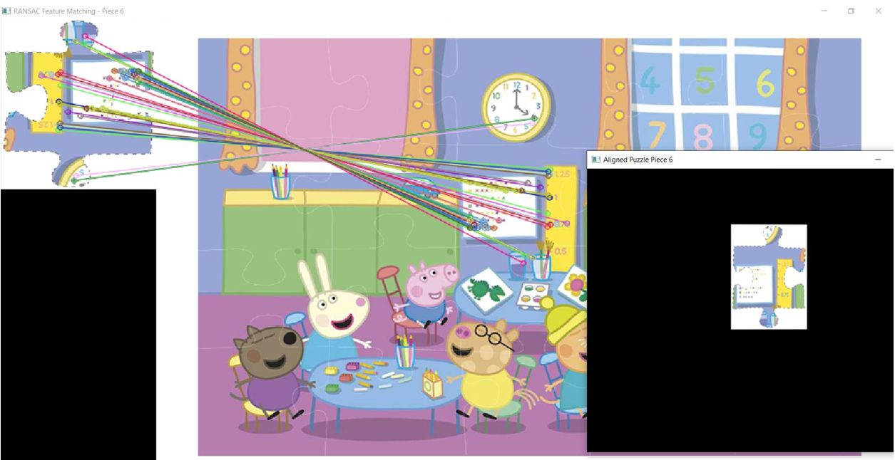

# Peppa Puzzle Reconstructor

This project automatically reconstructs a shuffled image of a Peppa Pig puzzle using computer vision techniques. The algorithm identifies and extracts puzzle pieces, matches them with their correct positions in a reference image using feature matching and RANSAC, and overlays them to restore the original image.
<p align="center">
  
  
  
</p>

## Preprocessing

Before reconstruction can take place, the shuffled puzzle image undergoes several preprocessing steps to isolate individual puzzle pieces:

1. **Grayscale Conversion**  
   The input image is converted to grayscale to simplify edge detection and reduce computational load.

2. **Edge Detection**  
   Canny edge detection is applied to highlight the contours of each puzzle piece.

3. **Morphological Operations**  
   Dilation and closing operations are used to strengthen the edges and close small gaps, making contours more distinct.

4. **Contour Detection**  
   External contours are identified to extract bounding boxes around each puzzle piece.

5. **Filtering by Area**  
   Small contours (noise or irrelevant fragments) are filtered out using a minimum area threshold to retain only meaningful puzzle segments.

The result of this preprocessing step is a set of cropped images — each representing a potential puzzle piece — which are then passed on for feature matching and reconstruction.
### Visual Output of Preprocessing
<p align="center">
  
  
  
</p>
  
## How It Works

1. **Piece Extraction**  
   Detects individual puzzle pieces from a shuffled image using edge detection and contour analysis via OpenCV.
<p align="center">
  
  
  
</p>

3. **Feature Matching with RANSAC**  
   Each puzzle piece is matched to a reference image using SIFT keypoints and descriptors. RANSAC is applied to estimate a homography matrix for accurate alignment.
<p align="center">
  
  
</p>

4. **Transparent Background**  
   White areas in the puzzle pieces are made transparent to blend seamlessly during reconstruction.
<p align="center">
  
</p>

5. **Puzzle Reconstruction**  
   Each aligned piece is overlayed onto a transparent canvas, rebuilding the complete puzzle.
<p align="center">
  
</p>

## Results
The reconstruction works even when the pieces are rotated or slightly misaligned, thanks to the robustness of the SIFT + RANSAC approach. While it performs well on clean images with distinct features, accuracy may decrease with blurry or low-contrast images.   

## Limitations

While the reconstruction pipeline is generally accurate, there are cases where two connected puzzle pieces are mistakenly treated as a single object during contour detection. This typically happens when:

- The gap between pieces is too small or visually subtle
- Morphological operations (dilation, closing) merge adjacent edges
- The white background isn't fully separated from piece boundaries

As a result, a few puzzle segments may be incorrectly aligned or misplaced in the final reconstruction.

Some extracted regions contained multiple puzzle pieces, as it's shown during the detection phase:


Future improvements could include:
- Adaptive contour separation techniques
- Color-based segmentation to better split adjacent regions
- Manual validation for ambiguous cases


## Files Used

- `peppa/peppa.png`: The original complete puzzle image (reference).
- `peppa/pz.png`: The image containing randomly placed/shuffled puzzle pieces.

## Requirements

- Python 3
- OpenCV (with `cv2.SIFT_create()` support, e.g., via `opencv-contrib-python`)
- NumPy

Install dependencies:

```bash
pip install opencv-contrib-python numpy
